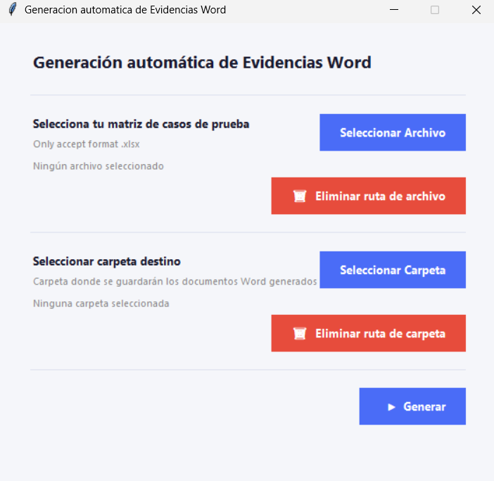
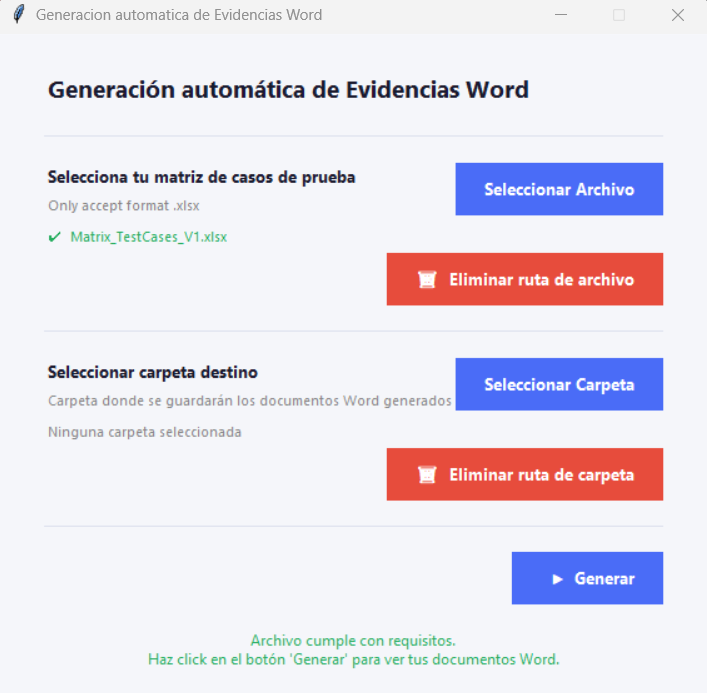
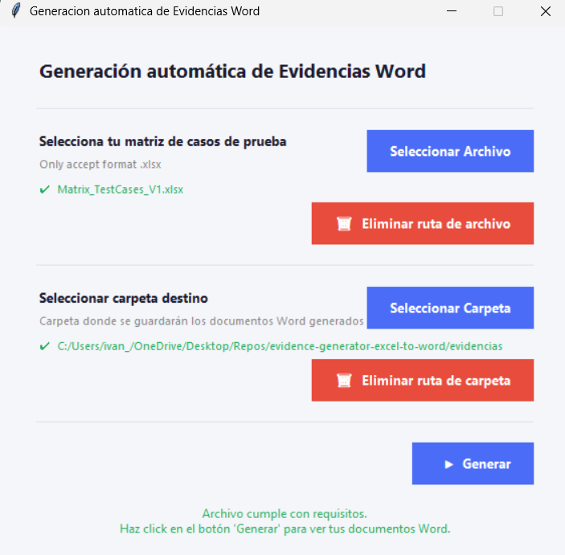
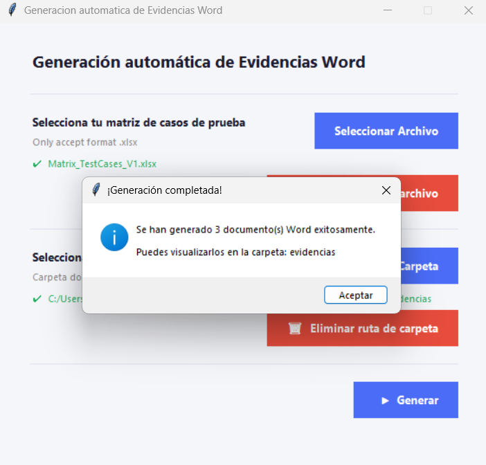

# 📄 Generación Automática de Evidencias Word

Herramienta de escritorio desarrollada en Python que automatiza la creación de documentos Word de evidencias de pruebas a partir de una matriz de casos de prueba en formato Excel.

Diseñada para equipos de QA que buscan reducir el tiempo invertido en documentación manual y enfocarse en lo que realmente importa: **ejecutar pruebas**.

---

## ⚙️ Requisitos previos

- Python 3.x instalado en tu máquina
- Tener `pip` disponible en tu entorno

---

## 🚀 Instalación Windows

**1. Clona el repositorio:**
```bash
git clone https://github.com/tu-usuario/tu-repositorio.git
cd tu-repositorio
```

**2. Crea y activa un entorno virtual:**
```bash
# 1. Crear entorno virtual
python -m venv env

# 2. Ir a la ruta del entorno virtual en Windows
cd env/Scripts/

# 3. Activar el entorno virtual
activate
```

**3. Instala las dependencias:**

```bash
# 1. Regresar a la carpeta env
cd.. 

# 2. Regresar a la carpeta qa-evidence-generator
cd..

# 3. Estando en la ruta del principal del proyecto realizamos el siguiente comando para instalar las dependencias

# Ejemplo:
# (env) C:\Users\{YOUR_USERNAME}\OneDrive\Desktop\Repos\evidence-generator-excel-to-word>pip install -r requirements.txt

pip install -r requirements.txt
```


## ▶️ Cómo ejecutar el programa

Una vez realizada la instalación en Windows, ejecutamos el siguiente comando:

```bash
python gui.py
```


---

## 📁 Estructura del proyecto

```
📂 tu-repositorio/
├── main.py                     # Backend: lógica de lectura del Excel y generación de Word
├── gui.py                      # Interfaz gráfica del programa
├── requirements.txt            # Librerías necesarias para ejecutar el proyecto
└── Matrix_TestCases_V1.xlsx    # Plantilla de referencia de la matriz de casos de prueba
```

---


**Flujo de uso:**

1. Haz click en **Seleccionar Archivo** y elige tu matriz de casos de prueba `.xlsx`
2. Haz click en **Seleccionar Carpeta** y elige dónde quieres guardar los documentos Word
3. Haz click en **Generar** y espera a que la barra de progreso termine
4. ¡Listo! Tus evidencias Word estarán en la carpeta que seleccionaste

---

## 📊 Formato esperado del Excel

El archivo Excel debe contener una hoja llamada `TestCases` con los siguientes encabezados **en este orden exacto**:

| Columna | Descripción |
|---|---|
| Funcionalidad | Módulo o funcionalidad que se está probando |
| Id CP | Identificador único del caso (ej. QA-FUNC-01) |
| Caso de Prueba | Nombre descriptivo del escenario |
| Descripcion | Descripción del objetivo del caso de prueba |
| Pre-Requisitos | Condiciones necesarias antes de ejecutar |
| Datos de Prueba | Datos de entrada utilizados |
| No. Paso | Número del paso |
| Descripcion del Paso | Detalle de la acción a ejecutar |
| Resultado Esperado | Resultado esperado por cada paso |
| Criticidad | Nivel de criticidad del caso |

> 📌 Usa el archivo `Matrix_TestCases_V1.xlsx` como plantilla de referencia.

---

## 📝 Resultado generado

Por cada `Id Caso de Prueba` encontrado en el Excel, el programa genera un archivo Word independiente con el siguiente formato:

```
📂 carpeta-destino/
├── QA-FUNC-01.docx
├── QA-FUNC-02.docx
└── QA-FUNC-03.docx
```

Cada documento incluye todos los campos del formato de evidencia listos para ser completados por el Tester tras la ejecución.

---

## 📷 Imagenes
|Vista Principal|Seleccionar Archivo| Seleccionar Carpeta Destino | Words Generados Correctamente |
|----|----|----|----|
||  |  |  |


## 👥 Equipo

Desarrollado para cualquier equipo de **QA**.

Made by: Claude Desktop + IvanBYA (Prompts and Validations)
